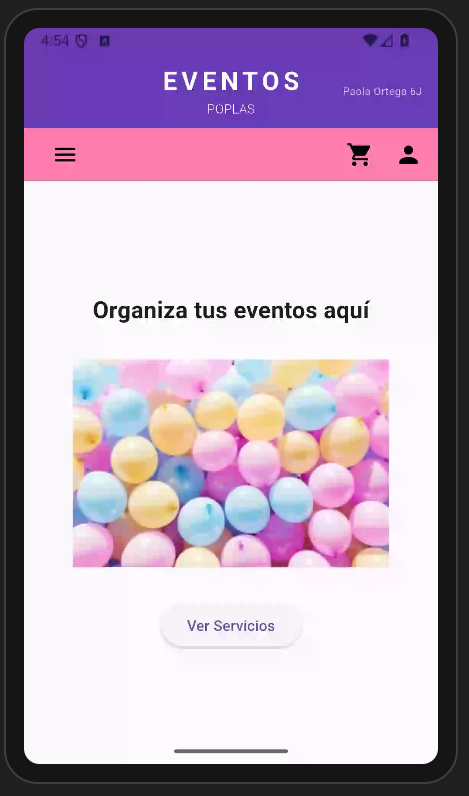
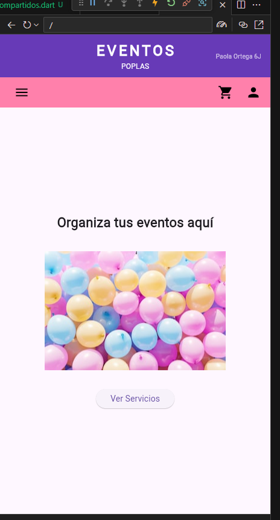
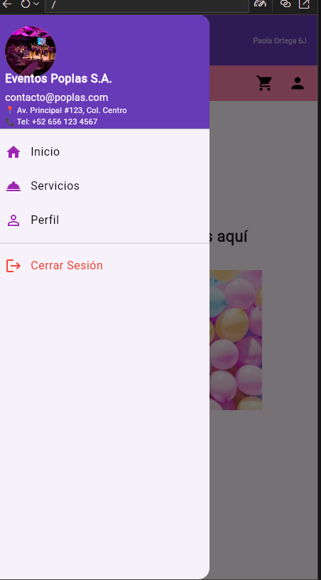
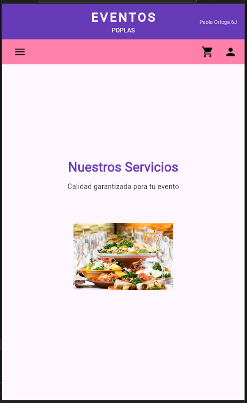
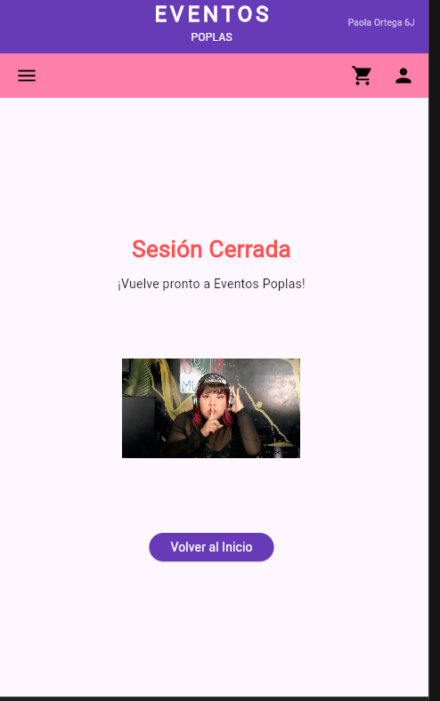

Instrucción: Genera un archivo README.md profesional para un proyecto de Flutter llamado "Eventos Poplas". El contenido debe estar en español y seguir esta estructura:

1. Título y Descripción

Título: Eventos Poplas S.A. - Gestión de Eventos.
Descripción: Aplicación móvil desarrollada en Flutter que implementa un sistema de navegación avanzado mediante rutas nombradas, menús laterales personalizados (Drawer) y un diseño de encabezado dinámico de doble barra.
2. Características Principales

Navegación Estructurada: Uso de routes en MaterialApp para una navegación limpia.
Interfaz Personalizada: Implementación de un CustomHeader con estilos morado y rosa, adaptado para dispositivos móviles.
Menú Lateral (Drawer): Un menú interactivo que incluye información de contacto (📍 Dirección y 📞 Teléfono) y navegación a secciones de Inicio, Servicios, Perfil y Cierre de Sesión.
Carga de Recursos Remotos: Visualización de imágenes centradas de 200x200 píxeles obtenidas desde repositorios externos (GitHub).
3. Estructura del Proyecto

Explicar la organización de las carpetas:
/lib/main.dart: Punto de entrada y definición de rutas.
/lib/widgets_compartidos.dart: Contiene el Header y el Drawer reutilizables.
/lib/LasPaginas/: Módulo que agrupa las vistas de la aplicación (inicio.dart, servicios.dart, perfil.dart, salir.dart).
4. Requisitos de Visualización

Mencionar que el diseño fue optimizado para pantallas móviles utilizando SafeArea y SingleChildScrollView.
Detallar que el proyecto utiliza el esquema de colores deepPurple y pinkAccent.
5. Créditos

Autor: Paola Ortega.
Grado y Grupo: 6J.

